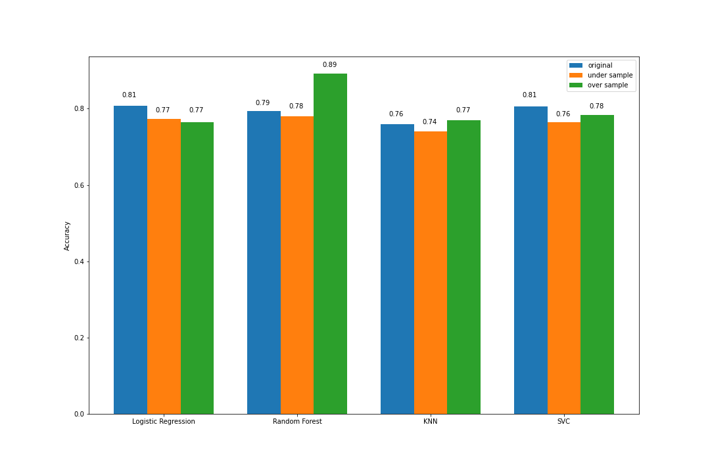

# Telecom Churn Detection

In ML and AI tasks, data plays an important rule. The very fisrt step of creating a ML model is to create a good dataset. However, in most cases, gathering good data is the most challenging part of project.  
One of the most frequent challenges is unbalanced data. There is some methods to overcome this problem such as under-sampling and over-sampling, which I will examine in this project.

In this repo I will make four different ML models with three different preprocessed data.  
Then i will make some comparisons between outputs of different models.

# Results

# TODO

- [x] Create Random Forest model
- [x] Create Logistic Regression model
- [x] Create KNN model
- [x] Create SVC model
- [ ] Create Deep Neural Network model